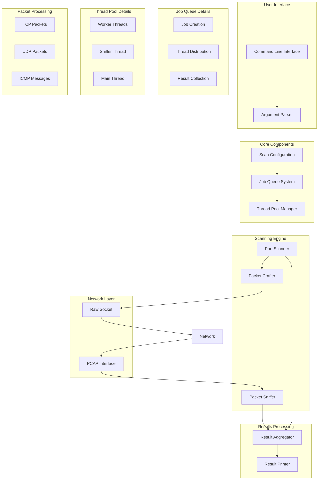

# 🔍 ft_nmap

A lightweight network port scanner implementation in C, inspired by nmap. This project demonstrates advanced socket programming, packet crafting, and multi-threaded network scanning techniques.

## 📋 Table of Contents
- [Features](#features)
- [Usage](#usage)
- [Architecture](#architecture)

## 📚 Additional Reading

For a deeper understanding of packet capture and network analysis:
- [Understanding PCAP: The Magic Key to Network Packet Capture](https://medium.com/@erdogancayir/pcap-nedir-a%C4%9F-paketlerini-yakalaman%C4%B1n-sihirli-anahtar%C4%B1-7ce4239340f6) - A comprehensive guide to PCAP (Turkish)

- [Understanding Raw Sockets](https://medium.com/@erdogancayir/raw-socketler-kullan%C4%B1m%C4%B1-raw-sockets-89f65d8ce063) - A comprehensive guide to RAW Sockets (Turkish)

## Features

- **Multiple Scan Types**
  - TCP SYN scan (half-open)
  - TCP NULL scan
  - TCP FIN scan
  - TCP XMAS scan
  - TCP ACK scan
  - UDP scan

- **Advanced Capabilities**
  - Port range scanning
  - Service name detection
  - Multi-threaded scanning (up to 250 threads)
  - Real-time packet capture using libpcap
  - Comprehensive port status reporting

- **User-Friendly Interface**
  - Intuitive command-line interface
  - Detailed scan results
  - Progress indication
  - Service name mapping

- **Advanced Scanning Modes**
  - **Evade Mode**
    - Random packet timing
    - Fragmented packets
    - IP ID randomization
    - TCP sequence number randomization
    - Custom TTL values
    - Protocol-specific evasion techniques

  - **Stealth Mode**
    - Slow scan rate
    - Random source ports
    - No ping probes
    - No DNS resolution
    - Minimal packet footprint
    - Covert timing patterns

  - **OS Detection Mode**
    - TCP/IP fingerprinting
    - TCP options analysis
    - IP ID sequence analysis
    - Window size analysis
    - TTL analysis
    - ICMP response analysis

  - **Host Resolution Mode**
    - DNS resolution
    - Reverse DNS lookup
    - Multiple DNS servers
    - DNS cache checking
    - Custom DNS timeout
    - DNS record types (A, AAAA, PTR)

  - **Version Detection Mode**
    - Service banner grabbing
    - Protocol-specific probes
    - SSL/TLS version detection
    - Application version fingerprinting
    - Custom version detection scripts
    - Version database matching

  - **IP Spoofing Mode**
    - Custom source IP
    - Random source IP
    - MAC address spoofing
    - IP ID spoofing
    - TCP sequence spoofing
    - Custom TTL spoofing

  - **Decoy IPs Mode**
    - Multiple decoy IPs
    - Random decoy selection
    - Decoy timing patterns
    - Decoy packet types
    - Custom decoy ratios
    - Decoy verification

### Scan Types

### TCP Scans
- **SYN Scan**: Half-open scan, sends SYN packet
- **NULL Scan**: Sends packet with no flags
- **FIN Scan**: Sends packet with FIN flag
- **XMAS Scan**: Sends packet with FIN, PSH, and URG flags
- **ACK Scan**: Sends packet with ACK flag

### UDP Scan
- Sends UDP packet
- Detects ICMP port unreachable messages

## Architecture

### Core Components
1. **Job Queue System**
   - Thread-safe task distribution
   - Dynamic job allocation
   - Producer-consumer pattern

2. **Packet Capture**
   - Real-time packet monitoring
   - libpcap integration
   - Thread-safe result processing

3. **Scanning Engine**
   - Multi-threaded port scanning
   - Custom packet crafting
   - Result aggregation

### Threading Model
- Main thread: Job distribution and result collection
- Worker threads: Port scanning
- Sniffer thread: Packet capture

### Job Queue System

The Job Queue is a central component that manages the distribution of scanning tasks across multiple threads. It implements a producer-consumer pattern to ensure efficient and thread-safe task distribution.

#### Visual Representation

```mermaid
graph TD
    A[Main Thread] -->|Creates Jobs| B[Job Queue] -->|G[Sniffer Thread]
    B -->|Distributes| C[Worker Thread 1]
    B -->|Distributes| D[Worker Thread 2]
    B -->|Distributes| E[Worker Thread N]
    G[Sniffer Thread] -->|Packet Data| F[Shared Results]
```

#### Example Job Matrix

For a scan with:
- Ports: 80, 443
- Scan Types: SYN, UDP
- Target IP: 192.168.1.1

The job queue will contain:

| Job ID | Port | Scan Type | Target IP    |
|--------|------|-----------|--------------|
| 1      | 80   | SYN       | 192.168.1.1 |
| 2      | 80   | UDP       | 192.168.1.1 |
| 3      | 443  | SYN       | 192.168.1.1 |
| 4      | 443  | UDP       | 192.168.1.1 |

#### Benefits

1. **Efficiency**
   - Dynamic job distribution
   - No idle threads
   - Optimal resource utilization

2. **Thread Safety**
   - Mutex-protected queue access
   - Condition variables for synchronization
   - No race conditions

3. **Scalability**
   - Easy to add more worker threads
   - Automatic load balancing
   - Configurable thread count

4. **Reliability**
   - No job duplication
   - No missed jobs
   - Graceful error handling

### Installing Dependencies
<details>
<summary>Click to expand</summary>

**macOS:**
```bash
brew install libpcap
```

**Ubuntu/Debian:**
```bash
sudo apt-get install libpcap-dev
```

**CentOS/RHEL:**
```bash
sudo yum install libpcap-devel
```
</details>

## Usage

### Basic Syntax

```bash
make debug or make
```

```bash
./ft_nmap [OPTIONS]
```

### Options

| Option | Description | Example | Required |
|--------|-------------|---------|----------|
| `--help` | Display this help screen | `./ft_nmap --help` | No |
| `--ports` | Ports to scan. Can be specified in three formats:<br>1. Range: `start-end`<br>2. List: `port1,port2,port3`<br>3. Mixed: `port1,start-end,port2` | `--ports 70-90`<br>`--ports 80,443,8080`<br>`--ports 70,75-85,90` | Yes |
| `--ip` | Target IP address in dot notation | `--ip 192.168.1.1` | Yes |
| `--file` | File containing IP addresses (one per line) | `--file targets.txt` | No |
| `--speedup` | Number of parallel threads (1-250) | `--speedup 70` | No (default: 1) |
| `--scan` | Scan types to perform. Can be one or more of:<br>SYN, NULL, FIN, XMAS, ACK, UDP<br>Multiple types can be combined with commas | `--scan SYN`<br>`--scan SYN,UDP`<br>`--scan SYN,NULL,FIN,XMAS,ACK,UDP` | Yes |

### Examples

1. Basic SYN scan:
```bash
sudo ./ft_nmap --ip 192.168.1.1 --speedup 70 --port 70-90 --scan SYN
```

2. Multiple scan types:
```bash
sudo ./ft_nmap --ip 192.168.1.1 --speedup 200 --port 75-85
```

3. Scan multiple ports with specific scan types:
```bash
sudo ./ft_nmap --ip 192.168.1.1 --speedup 100 --port 80,443,8080 --scan SYN,UDP
```

4. Scan from file with multiple ranges:
```bash
sudo ./ft_nmap --file targets.txt --speedup 150 --port 20-25,80,443,3306 --scan SYN,ACK
```

## 🏗️ System Architecture



### Thread Management

1. **Main Thread**
   - Handles user input
   - Manages configuration
   - Coordinates other threads

2. **Worker Threads**
   - Execute port scans
   - Craft packets
   - Process responses

3. **Sniffer Thread**
   - Captures network packets
   - Processes responses
   - Updates results


## 📦 TCP/IP Packet Size Management: MSS, MTU, and Fragmentation

### Understanding Packet Size Concepts

#### Maximum Segment Size (MSS)

MSS is the largest amount of data that can be carried in a single TCP segment. It's negotiated during the TCP three-way handshake and represents the maximum payload size that can be sent in one TCP segment.

```c
// TCP header structure showing MSS option
struct tcphdr {
    uint16_t th_sport;    // source port
    uint16_t th_dport;    // destination port
    uint32_t th_seq;      // sequence number
    uint32_t th_ack;      // acknowledgment number
    uint8_t  th_off;      // data offset (header length in 32-bit words)
    uint8_t  th_flags;    // TCP flags
    uint16_t th_win;      // window size
    uint16_t th_sum;      // checksum
    uint16_t th_urp;      // urgent pointer
    // Options (including MSS) follow
};
```

#### Maximum Transmission Unit (MTU)

MTU is the largest size of an IP packet that can be transmitted without fragmentation over a network link. It includes both IP header and payload.

```c
// IP header structure showing length fields
struct ip {
    uint8_t  ip_vhl;      // version << 4 | header length >> 2
    uint8_t  ip_tos;      // type of service
    uint16_t ip_len;      // total length
    uint16_t ip_id;       // identification
    uint16_t ip_off;      // fragment offset field
    uint8_t  ip_ttl;      // time to live
    uint8_t  ip_p;        // protocol
    uint16_t ip_sum;      // checksum
    struct   in_addr ip_src;
    struct   in_addr ip_dst;
};
```

### Packet Size Calculation

#### Calculating TCP Payload Length

```c
// Calculate TCP payload length from raw packet
size_t calculate_tcp_payload_length(const u_char *packet) {
    struct ip *ip_header = (struct ip *)packet;
    struct tcphdr *tcp_header = (struct tcphdr *)(packet + (ip_header->ip_vhl & 0x0F) * 4);
    
    // Total IP length - IP header length - TCP header length
    size_t payload_length = ntohs(ip_header->ip_len) - 
                          ((ip_header->ip_vhl & 0x0F) * 4) - 
                          (tcp_header->th_off * 4);
    
    return payload_length;
}
```

### IP Fragmentation

#### When Fragmentation Occurs

Fragmentation happens when an IP packet is larger than the MTU of the network link it needs to traverse. The packet is divided into smaller fragments, each containing a portion of the original data.

#### Fragmentation Fields

1. **Identification (ip_id)**
   - Unique identifier for all fragments of a packet
   - Used to reassemble fragments at the destination

2. **Fragment Offset (ip_off)**
   - Indicates where the fragment belongs in the original packet
   - Measured in 8-byte blocks
   ```c
   #define IP_OFFMASK 0x1fff  // fragment offset mask
   #define IP_DF 0x4000       // don't fragment flag
   #define IP_MF 0x2000       // more fragments flag
   ```

3. **Flags**
   - DF (Don't Fragment): If set, packet must not be fragmented
   - MF (More Fragments): If set, more fragments follow

### Practical Example: Raw Socket Packet Creation

```c
void create_tcp_packet(char *buffer, size_t payload_size) {
    struct ip *ip_header = (struct ip *)buffer;
    struct tcphdr *tcp_header = (struct tcphdr *)(buffer + sizeof(struct ip));
    char *payload = buffer + sizeof(struct ip) + sizeof(struct tcphdr);
    
    // IP header setup
    ip_header->ip_vhl = 4 << 4 | 5;  // IPv4, 5 32-bit words
    ip_header->ip_len = htons(sizeof(struct ip) + sizeof(struct tcphdr) + payload_size);
    ip_header->ip_off = htons(IP_DF);  // Don't fragment
    
    // TCP header setup
    tcp_header->th_off = 5;  // 5 32-bit words
    // ... other TCP header fields ...
    
    // Calculate total packet size
    size_t total_size = sizeof(struct ip) + sizeof(struct tcphdr) + payload_size;
    
    // Check if packet exceeds MTU
    if (total_size > MTU) {
        // Handle MTU exceedance (either fragment or error)
        if (ip_header->ip_off & IP_DF) {
            // Can't fragment, must handle error
            handle_mtu_exceedance();
        } else {
            // Fragment packet
            fragment_packet(buffer, total_size);
        }
    }
}
```

### Responsibility for Segmentation and Fragmentation

1. **TCP Segmentation**
   - TCP layer handles segmentation based on MSS
   - Ensures segments fit within MSS
   - Handles retransmission and flow control

2. **IP Fragmentation**
   - IP layer handles fragmentation based on MTU
   - Can occur at any router along the path
   - Reassembly happens only at the final destination

### Best Practices

1. **Avoiding Fragmentation**
   ```c
   // Set DF flag to prevent fragmentation
   ip_header->ip_off = htons(IP_DF);
   
   // Use path MTU discovery
   size_t path_mtu = discover_path_mtu(destination);
   ```

2. **Handling Fragmented Packets**
   ```c
   typedef struct s_fragment {
       uint16_t id;
       uint16_t offset;
       uint8_t more_fragments;
       char *data;
       size_t length;
   } t_fragment;
   
   void reassemble_fragments(t_fragment *fragments, int count) {
       // Sort by offset
       qsort(fragments, count, sizeof(t_fragment), compare_offsets);
       
       // Reconstruct original packet
       char *reassembled = malloc(total_length);
       for (int i = 0; i < count; i++) {
           memcpy(reassembled + fragments[i].offset, 
                  fragments[i].data, 
                  fragments[i].length);
       }
   }
   ```

### Common Scenarios

1. **MSS Negotiation**
   ```
   Client: SYN (MSS=1460)
   Server: SYN-ACK (MSS=1460)
   Client: ACK
   ```

2. **MTU Path Discovery**
   ```
   Sender: Packet with DF=1, size=1500
   Router: ICMP "Fragmentation Needed"
   Sender: Adjusts packet size
   ```

3. **Fragmentation Example**
   ```
   Original Packet (2000 bytes)
   ├── Fragment 1 (1500 bytes)
   │   ├── IP Header (MF=1, Offset=0)
   │   └── Data (1480 bytes)
   └── Fragment 2 (520 bytes)
       ├── IP Header (MF=0, Offset=185)
       └── Data (500 bytes)
   ```

This section provides a comprehensive understanding of packet size management in TCP/IP networking, from MSS negotiation to IP fragmentation handling. Understanding these concepts is crucial for implementing efficient and reliable network applications.

# 🧠 TCP/IP Fundamentals: MSS, MTU, Fragmentation, Payload, and Window Control

This README provides a detailed explanation of TCP/IP data transmission mechanics with focus on:

- MSS (Maximum Segment Size)
- MTU (Maximum Transmission Unit)
- IP Fragmentation
- TCP Payload Length calculation
- TCP Window Size
- TCP Window Scaling

It is especially useful for developers working with **raw sockets** or implementing low-level networking tools.

---

## 📦 MSS (Maximum Segment Size)

**MSS** is the maximum amount of **TCP payload (data)** that can be sent in a single TCP segment, **excluding headers**.

### ✅ How is MSS determined?
MSS is typically calculated as:

```
MSS = MTU - IP header size - TCP header size
```
On standard Ethernet:
```
MTU = 1500 bytes IP header = 20 bytes TCP header = 20 bytes → MSS = 1460 bytes
```


### 🔄 MSS Negotiation
- During the **TCP 3-way handshake**, each side advertises its MSS in the SYN packet via **TCP Options**.
- If not specified, the receiver assumes a default of **536 bytes** (per RFC 1122).

---

## 📏 MTU (Maximum Transmission Unit)

**MTU** is the **maximum size of an IP packet** that can be transmitted over a network link **including headers**.

- Ethernet MTU = **1500 bytes**
- If a packet exceeds the MTU, **IP fragmentation** may occur unless **DF (Don't Fragment)** is set.

---

## 💥 IP Fragmentation

When an IP packet exceeds the MTU:

- It is split into smaller **fragments** at the IP layer.
- Each fragment gets its own IP header.
- The receiver reassembles fragments using fields in the IP header.

### 🔍 Key Fields in IP Header

```c
struct ip {
    uint8_t  ip_hl:4;     // Header Length (×4 = bytes)
    uint8_t  ip_v:4;      // IP version
    uint16_t ip_len;      // Total length (header + payload)
    uint16_t ip_off;      // Fragment offset and flags (DF, MF)
};

```
ip_len: total length of the IP packet
ip_off: contains fragmentation info:
DF (Don't Fragment): if set, fragmentation is not allowed
MF (More Fragments): set if more fragments follow
Fragment Offset: location of the current fragment (in 8-byte blocks)
```

## 📐 Calculating TCP Payload Length

When working with **raw packets**, you may need to manually calculate the **TCP payload length** — i.e., the actual data carried inside the TCP segment excluding all headers.

### ✅ Required Fields

To calculate it, you need values from both the IP and TCP headers:

```c
int ip_header_len = ip_hdr->ip_hl * 4;            // IP header length in bytes
int ip_total_len  = ntohs(ip_hdr->ip_len);        // Total IP packet length in bytes

int tcp_header_len = tcp_hdr->th_off * 4;         // TCP header length in bytes

int tcp_payload_len = ip_total_len - ip_header_len - tcp_header_len;
```

ip_hdr->ip_hl: IP header length (in 32-bit words), multiply by 4 to convert to bytes
ip_hdr->ip_len: Total length of the IP packet (including IP + TCP + data); must convert from network byte order using ntohs()
tcp_hdr->th_off: TCP header length (also in 32-bit words), multiply by 4
The result: tcp_payload_len gives you the number of data bytes carried in that segment

## 📊 TCP Window Size and Flow Control

### 🔍 What is TCP Window Size?

The **TCP window size** (`th_win`) is a 16-bit field in the TCP header that tells the sender how many bytes it can send before requiring an acknowledgment. It plays a key role in **flow control**, ensuring the receiver is not overwhelmed by too much data at once.

```c
struct tcphdr {
    uint16_t th_sport;    // Source port
    uint16_t th_dport;    // Destination port
    uint32_t th_seq;      // Sequence number
    uint32_t th_ack;      // Acknowledgment number
    uint8_t  th_off;      // Header length (in 32-bit words)
    uint8_t  th_flags;    // TCP flags
    uint16_t th_win;      // Window size (in bytes)
    uint16_t th_sum;      // Checksum
    uint16_t th_urp;      // Urgent pointer
};
```

### 📐 MSS and Window Size Relationship
The maximum number of unacknowledged segments a sender can send is directly influenced by the window size and the MSS (Maximum Segment Size).

```
Window Size = 65535 bytes
MSS = 1460 bytes
→ Max in-flight segments = 65535 / 1460 ≈ 44 segments
```


### 📘 Common Flow Control Scenarios
1. 🛑 Zero Window (Receiver's buffer is full)

```
Sender: Sends data
Receiver: Advertises window = 0
Sender: Pauses sending
Receiver: Frees up buffer space, advertises a new window
Sender: Resumes sending
```

2. 📉 Dynamic Window Adjustments Due to Congestion

```
Initial: Window = 65535
Network congestion occurs → Window reduced to avoid further loss
Recovery → Window increases gradually (via slow start or congestion avoidance)
```

## 🔁 TCP Window Scaling (RFC 1323)

The TCP window size (`th_win`) field is only 16 bits, which limits it to a maximum of **65535 bytes**. In modern high-speed or high-latency networks (such as gigabit Ethernet or satellite links), this limit is often insufficient.  
**TCP Window Scaling**, introduced in **RFC 1323**, extends the window size beyond 64KB by applying a scaling factor.

---

### 🔬 How Window Scaling Works

The **effective window size** is calculated by multiplying the `th_win` field with a **scaling factor**, which is a power of 2:

```
Effective Window = th_win × 2^scale_factor
```


This allows TCP to advertise a window size up to **1 GB**.

---

### 📦 TCP Option Format

The scaling factor is sent during the **TCP 3-way handshake** in the SYN and SYN-ACK packets as part of TCP Options.

| Field        | Value                    |
|--------------|--------------------------|
| Kind         | `3` (Window Scale Option) |
| Length       | `3`                        |
| Shift Count  | 0–14 (scaling exponent)   |

- **Kind = 3**: Identifies this option as Window Scale.
- **Length = 3**: Total length of this option in bytes.
- **Shift Count**: The exponent for 2^n scaling.

Example TCP option as seen in Wireshark:

```
Window Scale: 7 (multiply by 128) Kind: 3 Length: 3 Shift Count: 7
```

### 💡 Example Calculation

```
th_win = 65535 Scale Factor = 7 → 2^7 = 128 Effective Window = 65535 × 128 = 8,388,480 bytes ≈ 8 MB
```


---

### ⚠️ Important Notes

- This option is only exchanged during the **initial handshake (SYN phase)**.
- **Both peers** must include the window scale option for scaling to take effect.
- If one side does not support it, the window remains limited to **65535 bytes**.

---

### ✅ Summary

| Concept             | Description |
|---------------------|-------------|
| **Window Scaling**  | Enables TCP window size beyond 64KB |
| **Sent in**         | SYN and SYN-ACK packets (during handshake) |
| **Required by**     | Both client and server |
| **Max Window Size** | Up to ~1 GB (with 2^14 scaling factor) |
| **Default Max**     | 65535 bytes without scaling |

