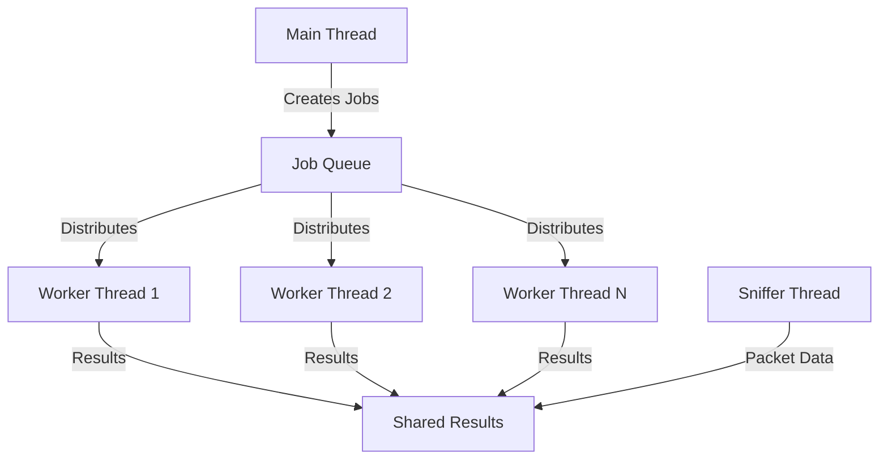
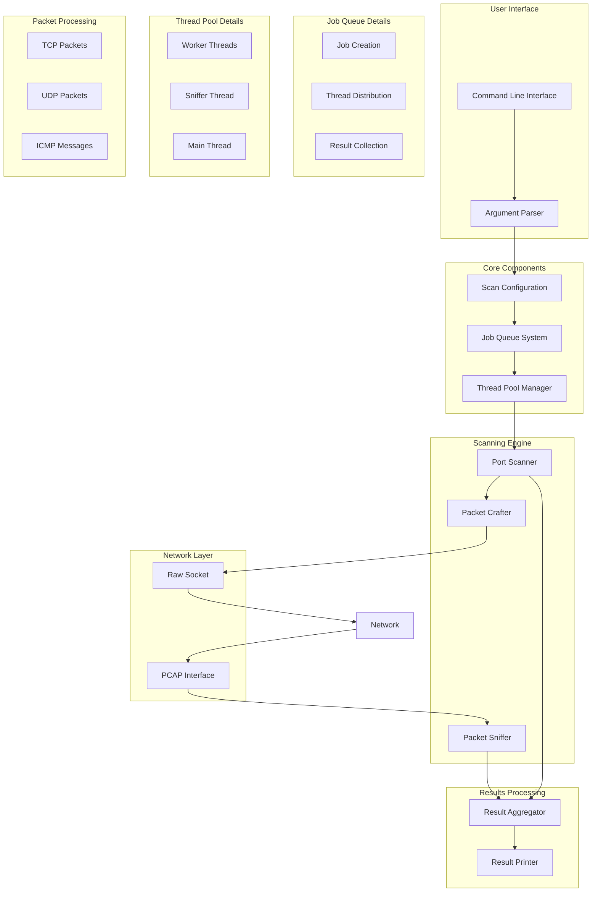

# 🔍 ft_nmap

A lightweight network port scanner implementation in C, inspired by nmap. This project demonstrates advanced socket programming, packet crafting, and multi-threaded network scanning techniques.

## 📋 Table of Contents
- [Features](#features)
- [Installation](#installation)
- [Usage](#usage)
- [Architecture](#architecture)

## 📚 Additional Reading

For a deeper understanding of packet capture and network analysis:
- [Understanding PCAP: The Magic Key to Network Packet Capture](https://medium.com/@erdogancayir/pcap-nedir-a%C4%9F-paketlerini-yakalaman%C4%B1n-sihirli-anahtar%C4%B1-7ce4239340f6) - A comprehensive guide to PCAP (Turkish)

## Features

- **Multiple Scan Types**
  - TCP SYN scan (half-open)
  - TCP NULL scan
  - TCP FIN scan
  - TCP XMAS scan
  - TCP ACK scan
  - UDP scan

- **Advanced Capabilities**
  - Port range scanning
  - Service name detection
  - Multi-threaded scanning (up to 250 threads)
  - Real-time packet capture using libpcap
  - Comprehensive port status reporting

- **User-Friendly Interface**
  - Intuitive command-line interface
  - Detailed scan results
  - Progress indication
  - Service name mapping

### Scan Types

### TCP Scans
- **SYN Scan**: Half-open scan, sends SYN packet
- **NULL Scan**: Sends packet with no flags
- **FIN Scan**: Sends packet with FIN flag
- **XMAS Scan**: Sends packet with FIN, PSH, and URG flags
- **ACK Scan**: Sends packet with ACK flag

### UDP Scan
- Sends UDP packet
- Detects ICMP port unreachable messages

## Architecture

### Core Components
1. **Job Queue System**
   - Thread-safe task distribution
   - Dynamic job allocation
   - Producer-consumer pattern

2. **Packet Capture**
   - Real-time packet monitoring
   - libpcap integration
   - Thread-safe result processing

3. **Scanning Engine**
   - Multi-threaded port scanning
   - Custom packet crafting
   - Result aggregation

### Threading Model
- Main thread: Job distribution and result collection
- Worker threads: Port scanning
- Sniffer thread: Packet capture

### Job Queue System

The Job Queue is a central component that manages the distribution of scanning tasks across multiple threads. It implements a producer-consumer pattern to ensure efficient and thread-safe task distribution.

#### How It Works

1. **Job Creation**
   - Main thread creates jobs based on:
     - Port ranges (e.g., 70-90)
     - Scan types (e.g., SYN, UDP)
     - Target IP addresses

2. **Job Structure**
```c
typedef struct s_job {
    uint16_t port;           // Port to scan
    uint8_t scan_type;       // Type of scan (SYN, NULL, etc.)
    char *target_ip;         // Target IP address
    struct s_job *next;      // Next job in queue
} t_job;
```

#### Visual Representation



#### Example Job Matrix

For a scan with:
- Ports: 80, 443
- Scan Types: SYN, UDP
- Target IP: 192.168.1.1

The job queue will contain:

| Job ID | Port | Scan Type | Target IP    |
|--------|------|-----------|--------------|
| 1      | 80   | SYN       | 192.168.1.1 |
| 2      | 80   | UDP       | 192.168.1.1 |
| 3      | 443  | SYN       | 192.168.1.1 |
| 4      | 443  | UDP       | 192.168.1.1 |

#### Benefits

1. **Efficiency**
   - Dynamic job distribution
   - No idle threads
   - Optimal resource utilization

2. **Thread Safety**
   - Mutex-protected queue access
   - Condition variables for synchronization
   - No race conditions

3. **Scalability**
   - Easy to add more worker threads
   - Automatic load balancing
   - Configurable thread count

4. **Reliability**
   - No job duplication
   - No missed jobs
   - Graceful error handling

## Technical Deep Dive
<details>
<summary>Click to expand</summary>

### Low-Level Port Scanning Implementation

This section provides a detailed technical explanation of how ft_nmap implements low-level port scanning using raw sockets and libpcap, focusing on packet behavior and response handling.

#### Core Components

1. **Raw Socket Implementation**
   ```c
   // Raw socket creation for packet crafting
   int sock = socket(AF_INET, SOCK_RAW, IPPROTO_TCP);
   if (sock < 0) {
       perror("Socket creation failed");
       exit(EXIT_FAILURE);
   }
   ```

2. **Packet Capture Setup**
   ```c
   // BPF filter for capturing responses
   char filter_exp[256];
   snprintf(filter_exp, sizeof(filter_exp),
            "(tcp and src host %s and (tcp[tcpflags] & (tcp-syn|tcp-ack|tcp-rst) != 0)) or "
            "(icmp and src host %s) or "
            "(udp and src host %s)",
            target_ip, target_ip, target_ip);
   ```

#### Response Analysis

1. **TCP Response Types**
   - **SYN-ACK Response**
     - Indicates an open port
     - Target is accepting connections
     - Scanner sends RST to close connection (half-open scan)
     ```c
     if (tcp_flags & TH_SYN && tcp_flags & TH_ACK) {
         port_status = PORT_OPEN;
         send_rst_packet();  // Close connection
     }
     ```

   - **RST Response**
     - Indicates a closed port
     - Target actively rejecting connection
     ```c
     if (tcp_flags & TH_RST) {
         port_status = PORT_CLOSED;
     }
     ```

   - **No Response**
     - Indicates a filtered port
     - Implement timeout mechanism
     ```c
     if (time_diff > SCAN_TIMEOUT_SECONDS) {
         port_status = PORT_FILTERED;
     }
     ```

2. **ICMP Message Handling**
   - **Destination Unreachable (Type 3)**
     - Code 3: Port Unreachable
     - Code 13: Communication Administratively Prohibited
     ```c
     if (icmp_type == 3) {
         switch (icmp_code) {
             case 3:  // Port Unreachable
                 port_status = PORT_CLOSED;
                 break;
             case 13: // Administratively Prohibited
                 port_status = PORT_FILTERED;
                 break;
         }
     }
     ```

#### Implementation Best Practices

1. **Timeout Handling**
   ```c
   #define SCAN_TIMEOUT_SECONDS 10
   typedef struct s_scan_result {
       time_t sent_time;
       char *status;
       // ... other fields
   } t_scan_result;
   ```

2. **Thread Synchronization**
   ```c
   pthread_mutex_t result_mutex = PTHREAD_MUTEX_INITIALIZER;
   void update_port_status(int port, char *status) {
       pthread_mutex_lock(&result_mutex);
       // Update status
       pthread_mutex_unlock(&result_mutex);
   }
   ```

3. **Resource Management**
   ```c
   void cleanup_resources(void) {
       close(raw_socket);
       pcap_close(handle);
       free_port_results();
       pthread_mutex_destroy(&result_mutex);
   }
   ```

#### Common Implementation Challenges

1. **Firewall Interactions**
   - Firewalls may:
     - Drop packets silently
     - Send ICMP Type 3 Code 13
     - Rate-limit responses
     - Block specific ports

2. **Network Conditions**
   - Handle network congestion
   - Account for varying response times
   - Implement retry mechanisms
   - Consider bandwidth limitations

3. **System Limitations**
   - Raw socket permissions
   - Resource constraints
   - Thread management
   - Memory usage

#### Performance Optimization

1. **Efficient Packet Capture**
   ```c
   // Set buffer size for packet capture
   pcap_set_buffer_size(handle, 65536);
   // Set immediate mode
   pcap_set_immediate_mode(handle, 1);
   ```

2. **Thread Pool Management**
   ```c
   #define MAX_THREADS 250
   typedef struct s_thread_pool {
       pthread_t threads[MAX_THREADS];
       int active_threads;
       // ... other fields
   } t_thread_pool;
   ```

3. **Memory Optimization**
   ```c
   // Pre-allocate packet buffers
   char *packet_buffer = malloc(MAX_PACKET_SIZE);
   // Reuse buffers for multiple scans
   memset(packet_buffer, 0, MAX_PACKET_SIZE);
   ```

#### Debugging Tips

1. **Packet Inspection**
   ```c
   void print_packet_details(const u_char *packet, int len) {
       struct ip *ip_header = (struct ip *)packet;
       struct tcphdr *tcp_header = (struct tcphdr *)(packet + sizeof(struct ip));
       // Print packet details
   }
   ```

2. **Response Analysis**
   ```c
   void analyze_response(const u_char *packet, int len) {
       // Check packet type
       // Analyze flags
       // Update port status
   }
   ```

3. **Error Handling**
   ```c
   void handle_scan_error(int error_code) {
       switch (error_code) {
           case SOCKET_ERROR:
               // Handle socket errors
               break;
           case CAPTURE_ERROR:
               // Handle capture errors
               break;
           // ... other cases
       }
   }
   ```

This technical deep dive provides implementation details and best practices for developers building similar low-level port scanners. The examples demonstrate proper handling of various response types, resource management, and performance optimization techniques.
</details>

### Installing Dependencies
<details>
<summary>Click to expand</summary>

**macOS:**
```bash
brew install libpcap
```

**Ubuntu/Debian:**
```bash
sudo apt-get install libpcap-dev
```

**CentOS/RHEL:**
```bash
sudo yum install libpcap-devel
```
</details>

## 🚀 Installation
<details>
<summary>Click to expand</summary>

1. Clone the repository:
```bash
git clone https://github.com/yourusername/ft_nmap.git
cd ft_nmap
```

2. Build the project:
```bash
make
```

3. Run with appropriate permissions:
```bash
sudo ./ft_nmap [OPTIONS]
```
</details>

## Usage
<details>
<summary>Click to expand</summary>

### Basic Syntax
```bash
./ft_nmap [OPTIONS]
```

### Options

| Option | Description | Example | Required |
|--------|-------------|---------|----------|
| `--help` | Display this help screen | `./ft_nmap --help` | No |
| `--ports` | Ports to scan. Can be specified in three formats:<br>1. Range: `start-end`<br>2. List: `port1,port2,port3`<br>3. Mixed: `port1,start-end,port2` | `--ports 70-90`<br>`--ports 80,443,8080`<br>`--ports 70,75-85,90` | Yes |
| `--ip` | Target IP address in dot notation | `--ip 192.168.1.1` | Yes |
| `--file` | File containing IP addresses (one per line) | `--file targets.txt` | No |
| `--speedup` | Number of parallel threads (1-250) | `--speedup 70` | No (default: 1) |
| `--scan` | Scan types to perform. Can be one or more of:<br>SYN, NULL, FIN, XMAS, ACK, UDP<br>Multiple types can be combined with commas | `--scan SYN`<br>`--scan SYN,UDP`<br>`--scan SYN,NULL,FIN,XMAS,ACK,UDP` | Yes |

### Examples

1. Basic SYN scan:
```bash
sudo ./ft_nmap --ip 192.168.1.1 --speedup 70 --port 70-90 --scan SYN
```

2. Multiple scan types:
```bash
sudo ./ft_nmap --ip 192.168.1.1 --speedup 200 --port 75-85
```

3. Scan multiple ports with specific scan types:
```bash
sudo ./ft_nmap --ip 192.168.1.1 --speedup 100 --port 80,443,8080 --scan SYN,UDP
```

4. Scan from file with multiple ranges:
```bash
sudo ./ft_nmap --file targets.txt --speedup 150 --port 20-25,80,443,3306 --scan SYN,ACK
```
</details>

## 🏗️ System Architecture



### Architecture Components

1. **User Interface Layer**
   - Command Line Interface (CLI)
   - Argument Parser
   - Configuration Management

2. **Core Components**
   - Scan Configuration
   - Job Queue System
   - Thread Pool Manager

3. **Scanning Engine**
   - Port Scanner
   - Packet Crafter
   - Packet Sniffer

4. **Network Layer**
   - Raw Socket Interface
   - PCAP Interface
   - Network Communication

5. **Results Processing**
   - Result Aggregator
   - Result Printer
   - Status Reporting

### Data Flow

1. **Command Processing**
   ```
   User Input → CLI → Argument Parser → Configuration
   ```

2. **Scan Execution**
   ```
   Configuration → Job Queue → Thread Pool → Scanner
   ```

3. **Network Operations**
   ```
   Scanner → Packet Crafter → Raw Socket → Network
   Network → PCAP → Sniffer → Results
   ```

4. **Result Handling**
   ```
   Scanner + Sniffer → Result Aggregator → Result Printer
   ```

### Thread Management

1. **Main Thread**
   - Handles user input
   - Manages configuration
   - Coordinates other threads

2. **Worker Threads**
   - Execute port scans
   - Craft packets
   - Process responses

3. **Sniffer Thread**
   - Captures network packets
   - Processes responses
   - Updates results

### Resource Management

1. **Memory Management**
   - Dynamic allocation for jobs
   - Buffer management for packets
   - Result storage optimization

2. **Thread Resources**
   - Thread pool sizing
   - Thread synchronization
   - Resource cleanup

3. **Network Resources**
   - Socket management
   - PCAP handle management
   - Buffer allocation

```bash
make debug
```


