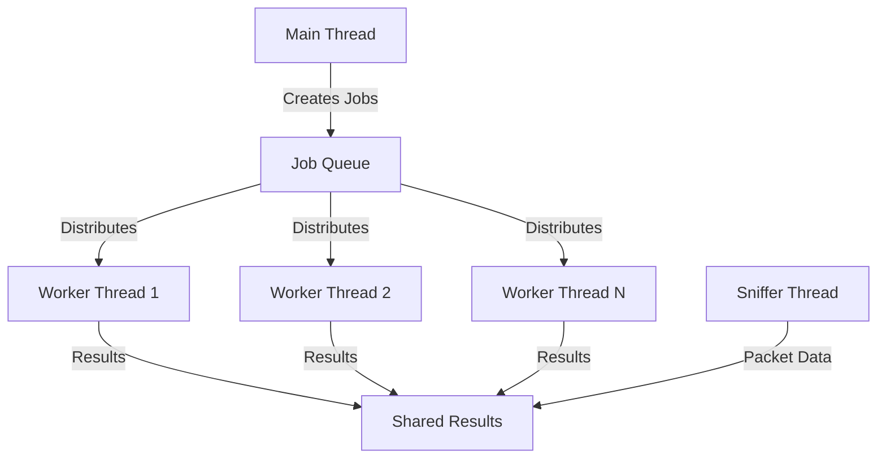

https://medium.com/@erdogancayir/pcap-nedir-a%C4%9F-paketlerini-yakalaman%C4%B1n-sihirli-anahtar%C4%B1-7ce4239340f6


# 🔍 ft_nmap

A lightweight network port scanner implementation in C, inspired by nmap. This project demonstrates advanced socket programming, packet crafting, and multi-threaded network scanning techniques.

## 📋 Table of Contents
- [Features](#features)
- [Prerequisites](#prerequisites)
- [Installation](#installation)
- [Usage](#usage)
- [Scan Types](#scan-types)
- [Architecture](#architecture)
- [Development](#development)
- [Contributing](#contributing)
- [License](#license)

## Features
<details>
<summary>Click to expand</summary>

- **Multiple Scan Types**
  - TCP SYN scan (half-open)
  - TCP NULL scan
  - TCP FIN scan
  - TCP XMAS scan
  - TCP ACK scan
  - UDP scan

- **Advanced Capabilities**
  - Port range scanning
  - Service name detection
  - Multi-threaded scanning (up to 250 threads)
  - Real-time packet capture using libpcap
  - Comprehensive port status reporting

- **User-Friendly Interface**
  - Intuitive command-line interface
  - Detailed scan results
  - Progress indication
  - Service name mapping
</details>

## Prerequisites
<details>
<summary>Click to expand</summary>

- C compiler (gcc/clang)
- Make
- libpcap development library
- Root privileges (for raw socket operations)
</details>

### Installing Dependencies
<details>
<summary>Click to expand</summary>

**macOS:**
```bash
brew install libpcap
```

**Ubuntu/Debian:**
```bash
sudo apt-get install libpcap-dev
```

**CentOS/RHEL:**
```bash
sudo yum install libpcap-devel
```
</details>

## 🚀 Installation
<details>
<summary>Click to expand</summary>

1. Clone the repository:
```bash
git clone https://github.com/yourusername/ft_nmap.git
cd ft_nmap
```

2. Build the project:
```bash
make
```

3. Run with appropriate permissions:
```bash
sudo ./ft_nmap [OPTIONS]
```
</details>

## 💻 Usage
<details>
<summary>Click to expand</summary>

### Basic Syntax
```bash
./ft_nmap [OPTIONS]
```

### Options

| Option | Description | Example | Required |
|--------|-------------|---------|----------|
| `--help` | Display this help screen | `./ft_nmap --help` | No |
| `--ports` | Ports to scan. Can be specified in three formats:<br>1. Range: `start-end`<br>2. List: `port1,port2,port3`<br>3. Mixed: `port1,start-end,port2` | `--ports 70-90`<br>`--ports 80,443,8080`<br>`--ports 70,75-85,90` | Yes |
| `--ip` | Target IP address in dot notation | `--ip 192.168.1.1` | Yes |
| `--file` | File containing IP addresses (one per line) | `--file targets.txt` | No |
| `--speedup` | Number of parallel threads (1-250) | `--speedup 70` | No (default: 1) |
| `--scan` | Scan types to perform. Can be one or more of:<br>SYN, NULL, FIN, XMAS, ACK, UDP<br>Multiple types can be combined with commas | `--scan SYN`<br>`--scan SYN,UDP`<br>`--scan SYN,NULL,FIN,XMAS,ACK,UDP` | Yes |

### Examples

1. Basic SYN scan:
```bash
sudo ./ft_nmap --ip 192.168.1.1 --speedup 70 --port 70-90 --scan SYN
```

2. Multiple scan types:
```bash
sudo ./ft_nmap --ip 192.168.1.1 --speedup 200 --port 75-85
```

3. Scan multiple ports with specific scan types:
```bash
sudo ./ft_nmap --ip 192.168.1.1 --speedup 100 --port 80,443,8080 --scan SYN,UDP
```

4. Scan from file with multiple ranges:
```bash
sudo ./ft_nmap --file targets.txt --speedup 150 --port 20-25,80,443,3306 --scan SYN,ACK
```

### Output Format
```
Scan Configurations
Target Ip-Address : x.x.x.x
No of Ports to scan : 20
Scans to be performed : SYN
No of threads : 70

Open ports:
Port Service Name (if applicable) Results Conclusion
----------------------------------------------------------------------------------------
80 http SYN(Open) Open

Closed/Filtered/Unfiltered ports:
Port Service Name (if applicable) Results Conclusion
----------------------------------------------------------------------------------------
90 Unassigned SYN(Filtered) Filtered
```
</details>

## Scan Types
<details>
<summary>Click to expand</summary>

### TCP Scans
- **SYN Scan**: Half-open scan, sends SYN packet
- **NULL Scan**: Sends packet with no flags
- **FIN Scan**: Sends packet with FIN flag
- **XMAS Scan**: Sends packet with FIN, PSH, and URG flags
- **ACK Scan**: Sends packet with ACK flag

### UDP Scan
- Sends UDP packet
- Detects ICMP port unreachable messages
</details>

## 🏗️ Architecture
<details>
<summary>Click to expand</summary>

### Core Components
1. **Job Queue System**
   - Thread-safe task distribution
   - Dynamic job allocation
   - Producer-consumer pattern

2. **Packet Capture**
   - Real-time packet monitoring
   - libpcap integration
   - Thread-safe result processing

3. **Scanning Engine**
   - Multi-threaded port scanning
   - Custom packet crafting
   - Result aggregation

### Threading Model
- Main thread: Job distribution and result collection
- Worker threads: Port scanning
- Sniffer thread: Packet capture

### Job Queue System

The Job Queue is a central component that manages the distribution of scanning tasks across multiple threads. It implements a producer-consumer pattern to ensure efficient and thread-safe task distribution.

#### How It Works

1. **Job Creation**
   - Main thread creates jobs based on:
     - Port ranges (e.g., 70-90)
     - Scan types (e.g., SYN, UDP)
     - Target IP addresses

2. **Job Structure**
```c
typedef struct s_job {
    uint16_t port;           // Port to scan
    uint8_t scan_type;       // Type of scan (SYN, NULL, etc.)
    char *target_ip;         // Target IP address
    struct s_job *next;      // Next job in queue
} t_job;
```

#### Visual Representation



#### Example Job Matrix

For a scan with:
- Ports: 80, 443
- Scan Types: SYN, UDP
- Target IP: 192.168.1.1

The job queue will contain:

| Job ID | Port | Scan Type | Target IP    |
|--------|------|-----------|--------------|
| 1      | 80   | SYN       | 192.168.1.1 |
| 2      | 80   | UDP       | 192.168.1.1 |
| 3      | 443  | SYN       | 192.168.1.1 |
| 4      | 443  | UDP       | 192.168.1.1 |

#### Benefits

1. **Efficiency**
   - Dynamic job distribution
   - No idle threads
   - Optimal resource utilization

2. **Thread Safety**
   - Mutex-protected queue access
   - Condition variables for synchronization
   - No race conditions

3. **Scalability**
   - Easy to add more worker threads
   - Automatic load balancing
   - Configurable thread count

4. **Reliability**
   - No job duplication
   - No missed jobs
   - Graceful error handling
</details>

## Development

### Project Structure
```